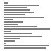

# Algorithms

I challanged myself to implement the most famous algorithms in rust. 

## Table of Contents
- [Sorting Algorithms]()
- [Search Algorithms]() [not-implemented-yet]
- [Data Structures]() [not-implemented-yet]
<!-- - Mathematical Algorithms -->
<!-- - Compression Algorithms (e.g. GZIP) -->

## Sort Algorithms

- [Bubble Sort]()
- [Bucket Sort]() [not-implemented-yet]
- [Counting Sort]()
- [Gnome Sort]()
- [Heap Sort]() [not-implemented-yet]
- [Insertion]() Sort
- [Merge Sort]() [not-implemented-yet]
- [Quick Sort]() [not-implemented-yet]
- [Radix Sort]() [not-implemented-yet]
- [Selection Sort]()
- [Shell Sort]() [not-implemented-yet]
- [Slow Sort]() [not-implemented-yet]

#### Bubble Sort

